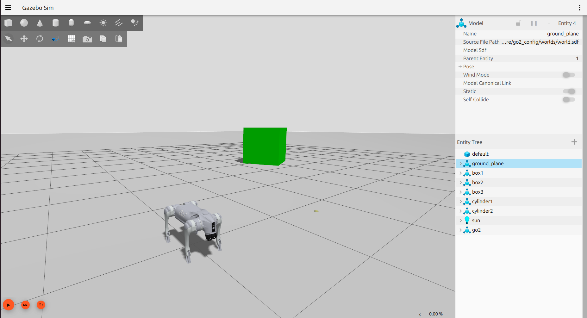
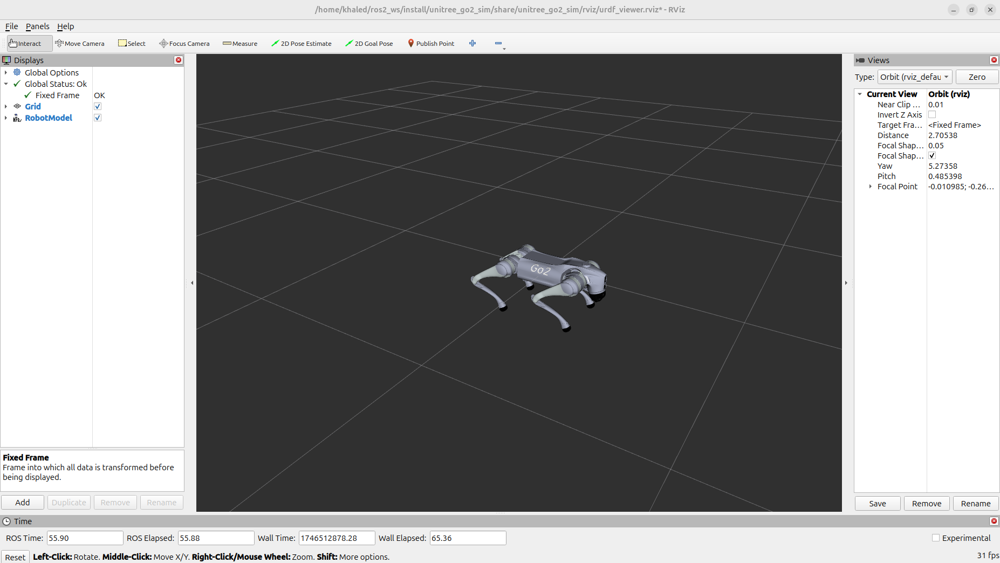

# Unitree Go2 ROS2


## Overview

This package provides a complete ROS 2 Jazzy integration for the Unitree Go2 quadrupedal robot using the CHAMP controller framework. It includes custom configuration packages and robot description models specifically adapted for ROS 2, enabling simulation, control, and autonomous operation capabilities.

## About Unitree Go2

The Go2 is a quadrupedal robot manufactured by Unitree Robotics, designed for both research and commercial applications. It features powerful actuators, advanced sensor integration, and a robust mechanical design capable of navigating various terrains.

## About CHAMP Controller

CHAMP (Coupled Hybrid Automata for Mobile Platforms) is an open-source development framework designed for quadrupedal robots. It provides a hierarchical control system that combines pattern modulation and impedance control techniques for efficient locomotion.


## Features

- ✅ Complete ROS 2 Jazzy integration
- ✅ URDF model adapted to ROS 2 control framework
- ✅ Gazebo Harmonic simulation support
- ✅ Teleoperation using keyboard
- ✅ RVIZ visualization
- ✅ Integrated gait control and configuration
- ❌ Simulated sensors (in progress):
  - ❌ IMU
  - ❌ 2D LiDAR (Hokuyo)
  - ❌ 3D LiDAR (Velodyne)
- ❌ Full SLAM functionality (Coming soon)
- ❌ Navigation 2 integration (Coming soon)

## System Requirements

- Ubuntu 24.04
- ROS 2 Jazzy
- Gazebo Sim Harmonic

## Installation

### 1. Install ROS 2 Dependencies

```bash
sudo apt update
sudo apt install ros-jazzy-gazebo-ros2-control
sudo apt install ros-jazzy-xacro
sudo apt install ros-jazzy-robot-localization
sudo apt install ros-jazzy-ros2-controllers
sudo apt install ros-jazzy-ros2-control
sudo apt install ros-jazzy-velodyne
sudo apt install ros-jazzy-velodyne-gazebo-plugins
sudo apt install ros-jazzy-velodyne-description
```

### 2. Clone and Install CHAMP Controller and Go2 Simulation Packages

```bash
cd ~/ros2_ws/src
git clone https://github.com/khaledgabr77/unitree_go2_ros2
```

### 3. Install Dependencies

```bash
cd ~/ros2_ws
rosdep update
rosdep install --from-paths src --ignore-src -r -y
```

### 4. Build the Workspace

```bash
cd ~/ros2_ws
colcon build
source install/setup.bash
```

## Usage

### Gazebo Simulation

Launch the Gazebo simulation:

```bash
ros2 launch unitree_go2_sim unitree_go2_launch.py
```



[Watch Demo on YouTube](https://youtu.be/NUu7TaZhaQM)

### RVIZ Visualization

Launch Gazebo with RVIZ:

```bash
ros2 launch unitree_go2_sim unitree_go2_launch.py rviz:=true
```



### Teleoperation

Control the robot using keyboard:

```bash
ros2 run teleop_twist_keyboard teleop_twist_keyboard
```

## Tuning Gait Parameters

The gait configuration for the robot is found in `unitree_go2_sim/config/gait/gait.yaml`. You can modify the following parameters:

| Parameter | Description |
|-----------|-------------|
| Knee Orientation | How the knees should be bent (.>> .>< .<< .<>) |
| Max Linear Velocity X | Maximum forward/reverse speed (m/s) |
| Max Linear Velocity Y | Maximum sideways speed (m/s) |
| Max Angular Velocity Z | Maximum rotational speed (rad/s) |
| Stance Duration | How long each leg spends on the ground while walking |
| Leg Swing Height | Trajectory height during swing phase (m) |
| Leg Stance Height | Trajectory depth during stance phase (m) |
| Robot Walking Height | Distance from hip to ground while walking (m) |
| CoM X Translation | Offset to compensate for weight distribution |
| Odometry Scaler | Multiplier to calculated velocities for dead reckoning |

## Project Structure

- `champ/`: Core controllers and state estimation for CHAMP
- `unitree_go2_description/`: URDF models, meshes, and world files
- `unitree_go2_sim/`: Simulation launch files and configuration

## Contributing

Contributions are welcome! Please feel free to submit a Pull Request.

1. Fork the repository
2. Create your feature branch (`git checkout -b feature/AmazingFeature`)
3. Commit your changes (`git commit -m 'feat: Add some AmazingFeature'`)
4. Push to the branch (`git push origin feature/AmazingFeature`)
5. Open a Pull Request

## Acknowledgements

This project builds upon and incorporates work from the following projects:

* [Unitree Robotics](https://github.com/unitreerobotics/unitree_ros) - For the Go2 robot description (URDF model)
* [CHAMP](https://github.com/chvmp/champ) - For the quadruped controller framework
* [CHAMP Robots](https://github.com/chvmp/robots) - For robot configurations and setup examples
* [unitree-go2-ros2](https://github.com/anujjain-dev/unitree-go2-ros2) - ROS 2 package with gazebo classic

## License

This project is licensed under the BSD 3-Clause License - see the LICENSE file for details.